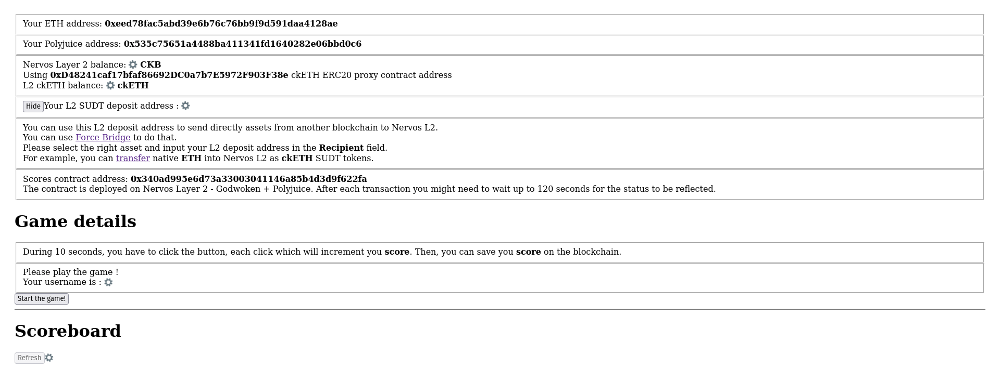
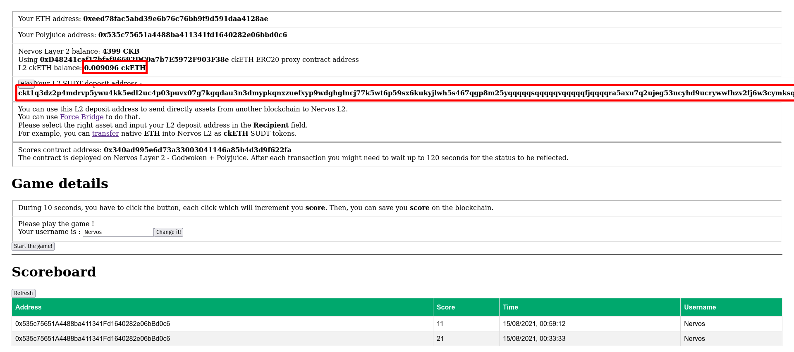
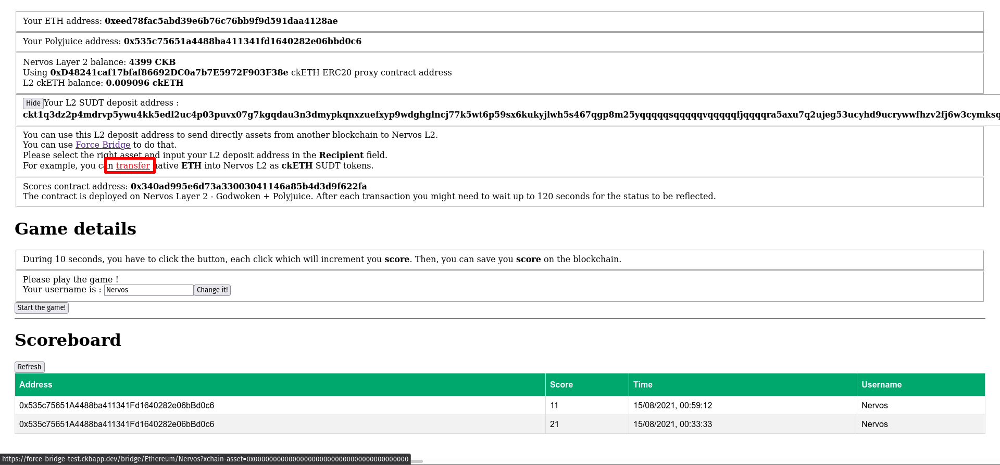
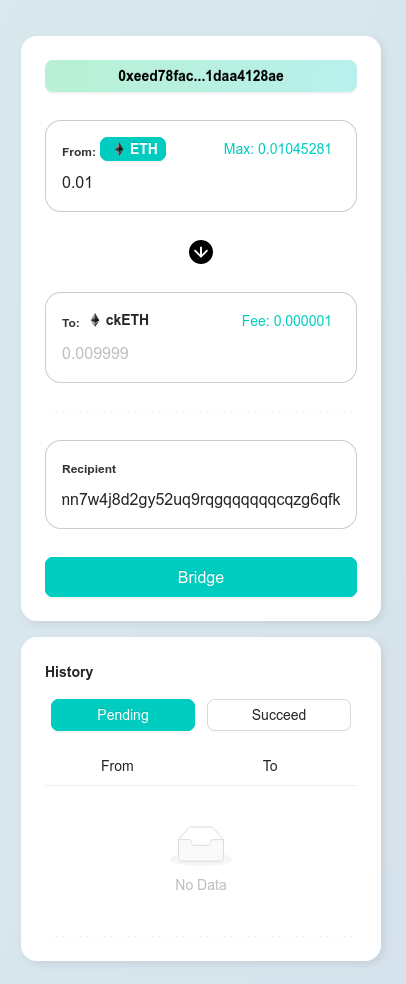
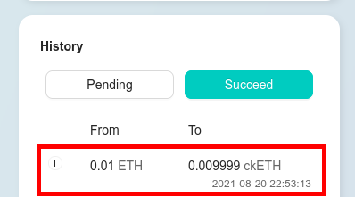
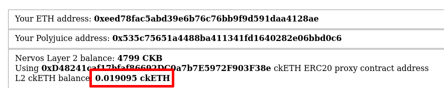

# Click The Block

Created for `Nervos Hackaton`, task 8 : https://gitcoin.co/issue/nervosnetwork/grants/9/100026215

Based on : https://github.com/Schrubitteflau/Nervos-7-Click-The-Block

Useful documentation : https://docs.nervos.org/docs/essays/rules#script

# Getting started

## Install the dependencies
```bash
yarn
```

## Compile the smart contracts
```bash
yarn build
```

## Start the UI
```bash
yarn ui
```

# ckETH SUDT ERC20 Proxy Contract Deployment
```
Using Ethereum address: 0xeed78FAc5abd39e6b76c76bB9f9d591DaA4128ae
Deploying contract...
Transaction hash: 0x50f8acc808c03eeb3e86514d339d45ebe11b7d9d6f9786ca1a9d04559139f5dc
Deployed SUDT-ERC20 Proxy contract address: 0xD9AF85FcBEc4C60d3a6E3175c88Df58aE27095D6
```

# Demo : adding funds to L2

## Open the app and wait while the values are loading



## Check your L2 ckETH balance



## Click on "transfer" and get redirected in Force Bridge app



## Enter the amount of ETH to transfer to L2 and fill the recipient with your L2 deposit address



## Sign the transaction


## Wait for the bridge transfer to be completed



## Reload the app and see the new amount of ckETH



# Smart contract : Scores.sol

```sol
pragma solidity >=0.8.0;

contract Scores {

  Score[] public scores;
  
  // Usernames per address
  mapping(address => string) public usernames;

  // Each Score is represented by an user, the score and a timestamp
  struct Score {
    address user;
    uint score;
    uint time;
  }
  
  // Used as return type of getLatestScores()
  struct ScoreWithUsername {
    address user;
    uint score;
    uint time;
    string username;
  }
  
  // Add a score
  function addScore(uint _score) public {
      require(_score > 0, "Score must be > 0");
      
      Score memory score = Score({
          user: msg.sender,
          score: _score,
          time: block.timestamp
      });
      scores.push(score);
  }
  
  // Attach a username to an address
  function setUsername(string memory _username) public {
      require(bytes(_username).length >= 3 && bytes(_username).length <= 10, "Username must be between 3 and 10 characters");

      usernames[msg.sender] = _username;
  }
  
  // Get the number of stored scores
  function scoresCount() external view returns(uint) {
      return scores.length;
  }
  
  // Get the _count latest scores
  function getLatestScores(uint _count) public view returns (ScoreWithUsername[] memory) {
      require(_count > 0, "Count must be > 0");

      uint scoresLength = scores.length;
      // _count max value is scoresLength
      uint count = (_count > scoresLength ? scoresLength : _count);
      // Return array
      ScoreWithUsername[] memory latestScores = new ScoreWithUsername[](count);
      
      for (uint i = 0; i < count; i++)
      {
          // Pointer to the stored score
          Score storage score = scores[scoresLength - i - 1];
          // Username (optional) of the user
          string memory username = usernames[score.user];
          // New struct with username
          ScoreWithUsername memory scoreWithUsername = ScoreWithUsername({
              user: score.user,
              score: score.score,
              time: score.time,
              username: username
          });
          // Append it to the return array
          latestScores[i] = scoreWithUsername;
      }
      
      return latestScores;
  }
}
```

ABI :
```json
[
    {
        "inputs": [
            {
                "internalType": "uint256",
                "name": "",
                "type": "uint256"
            }
        ],
        "name": "scores",
        "outputs": [
            {
                "internalType": "address",
                "name": "user",
                "type": "address"
            },
            {
                "internalType": "uint256",
                "name": "score",
                "type": "uint256"
            },
            {
                "internalType": "uint256",
                "name": "time",
                "type": "uint256"
            }
        ],
        "stateMutability": "view",
        "type": "function"
    },
    {
        "inputs": [
            {
                "internalType": "address",
                "name": "",
                "type": "address"
            }
        ],
        "name": "usernames",
        "outputs": [
            {
                "internalType": "string",
                "name": "",
                "type": "string"
            }
        ],
        "stateMutability": "view",
        "type": "function"
    },
    {
        "inputs": [
            {
                "internalType": "uint256",
                "name": "_score",
                "type": "uint256"
            }
        ],
        "name": "addScore",
        "outputs": [],
        "stateMutability": "nonpayable",
        "type": "function"
    },
    {
        "inputs": [
            {
                "internalType": "string",
                "name": "_username",
                "type": "string"
            }
        ],
        "name": "setUsername",
        "outputs": [],
        "stateMutability": "nonpayable",
        "type": "function"
    },
    {
        "inputs": [],
        "name": "scoresCount",
        "outputs": [
            {
                "internalType": "uint256",
                "name": "",
                "type": "uint256"
            }
        ],
        "stateMutability": "view",
        "type": "function"
    },
    {
        "inputs": [
            {
                "internalType": "uint256",
                "name": "_count",
                "type": "uint256"
            }
        ],
        "name": "getLatestScores",
        "outputs": [
            {
                "components": [
                    {
                        "internalType": "address",
                        "name": "user",
                        "type": "address"
                    },
                    {
                        "internalType": "uint256",
                        "name": "score",
                        "type": "uint256"
                    },
                    {
                        "internalType": "uint256",
                        "name": "time",
                        "type": "uint256"
                    },
                    {
                        "internalType": "string",
                        "name": "username",
                        "type": "string"
                    }
                ],
                "internalType": "struct Scores.ScoreWithUsername[]",
                "name": "",
                "type": "tuple[]"
            }
        ],
        "stateMutability": "view",
        "type": "function"
    }
]
```
